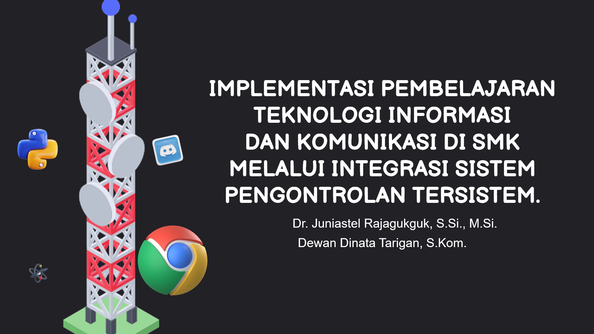
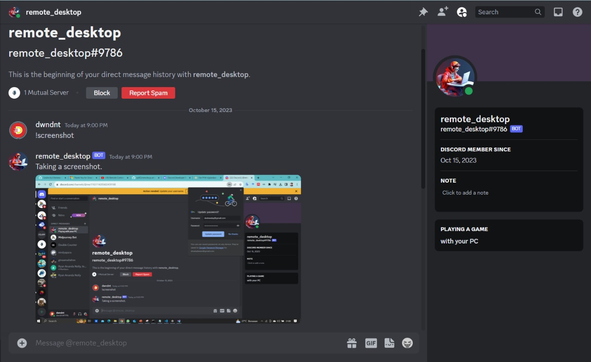
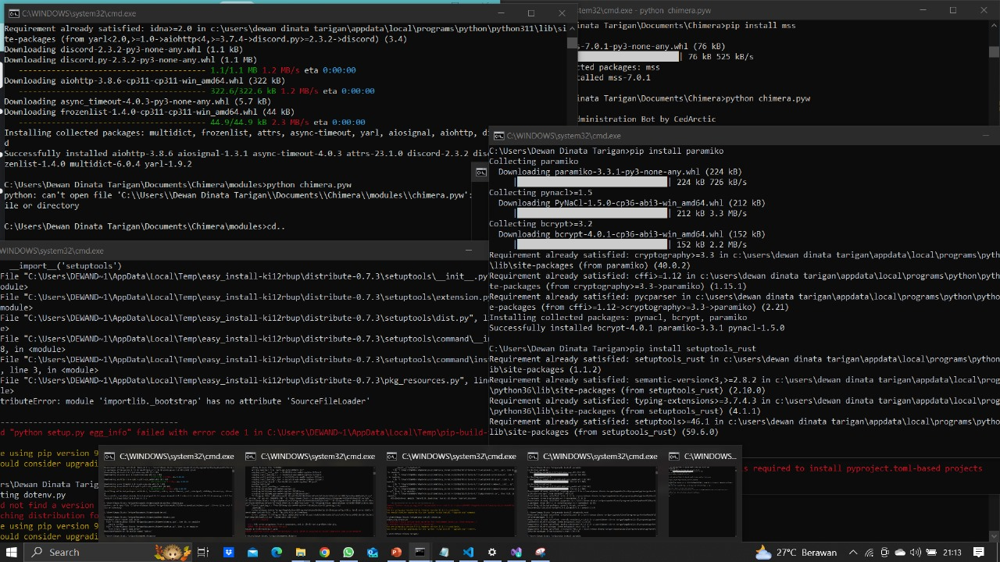

# Pengontrolan Tersistem : Chimera Remote Control Dekstop

Repositori ini berisikan Materi & kebutuhan eksperimen dalam program kegiatan Pengembangan Keprofesian Berkelanjutan (PKB) bagi guru dan tenaga kependidikan provinsi SUMUT.
Setiap program dalam repositori ini sudah di-update agar dapat berjalan dengan semestinya, termasuk program Chimera Remote Control Dekstop.
Sekilas mengenai materi pada pelatihan ini antara lain :
- Pengenalan & Instalasi Python
- Pengenalan & Instalasi Git
- Pengenalan & Instalasi Microsoft Visual Studio
- Pengenalan & Instalasi Discord Server
- Pengenalan & Operasional Chimera
- System Remote Control Desktop 
- Error Handling Python Programming

## Documentation Preview :
**) Catatan : Program chimera pada repository ini merupakan pengembangan dari https://github.com/CedArctic/Chimera

| Chimera Bot Discord | Error Handling - Installation |
|----------|----------|
|  |  |

## Chimera
Chimera adalah sebuah bot Discord lintas platform yang dirancang untuk mengontrol Sistem jarak jauh. Ini dibuat dengan seksama menggunakan perpustakaan discord.py dalam bahasa pemrograman Python. Yang menarik dari Chimera adalah kemampuannya untuk mengelola komputer Anda dari jarak jauh. Mulai dari tugas-tugas dasar seperti mematikan, menjadikan komputer tidur, atau mengunci, hingga tindakan yang lebih kompleks seperti berbicara atau menjalankan perintah PowerShell. Satu hal yang perlu diperhatikan tentang Chimera adalah bahwa ini adalah bot yang di-host sendiri. Ini berarti Anda perlu menjalankannya di komputer Anda sendiri, mesin yang ingin Anda kendalikan menggunakan perintah Discord. Proses instalasi Chimera terbilang sangat mudah, hanya memakan sekitar 3 menit.

## Requirements:
* Python 3
* discord.py
* mss
* opencv-python
* pynput
* requests
* python-dotenv
* pystray
* Pillow

## Features List:
* openurl
* lock
* appquitter
* shutdown
* sleep
* hibernate
* restart
* logoff
* cmd
* powershell
* screenshot
* say
* media
* camera
* echo
* log
* file
* launch
* notification
* helpme

## Features Documentation:

* !helpme or !helpme *command*
	> shows Chimera help, listing commands of shows help for a specific command, e.g: !helpme screenshot
* !openurl *url*
	> opens url in default browser, e.g: !openurl https://example.com
* !lock or !lock *seconds*
	> locks your computer immediately or with a time delay in seconds, e.g: !lock 30
* !appquitter *Application_Name* or !appquitter *Application_Name* *minutes*
	> quits the specified application immediately or with a time delay in minutes, e.g: !appquitter chrome 30
* !shutdown or !shutdown *seconds*
	> shuts down your computer immediately or with a time delay in seconds, e.g: !shutdown 30
* !sleep or !sleep *seconds*
	> sleeps your computer immediately or with a time delay in seconds, e.g: !sleep 30
* !hibernate or !hibernate *seconds*
	> hibernates your computer immediately or with a time delay in seconds, e.g: !hibernate 30
* !restart or !restart *seconds*
	> restarts your computer immediately or with a time delay in seconds, e.g: !restart 30
* !logoff or !logoff *seconds*
	> logs off your user immediately or with a time delay in seconds, e.g: !logoff 30

* !cmd "*command*"
	> executes *command* in cmd.exe
* !powershell "*command*"
	> executes *command* in Powershell

* !screenshot or !screenshot *seconds*
	> takes a screenshot of your computer and sends it back to you 
* !say "*text*"
	> uses powershell commands and a TTS engine to make your computer say something

* !media *command* or !media *command* *repeat_n_times*
	> controls computer media playback and volume once or repeatedly, e.g: !media prev 2
		list of commands:
		- vol-up
		- vol-down
		- vol-mute
		- next
		- prev
		- stop
		- play
		- pause
		
* !camera *command* or !camera *command* *time*
	> controls computer camera for taking photo or filming for a given *time* in seconds (default is 5 seconds), e.g: !camera video 10
		list of commands:
		- video time
		- photo
		
* !echo *status*
	> turns on or off !cmd and !powershell command echo in chat. When turned on, the command return will be sent to chat, e.g: !echo on / !echo off
	
* !log *param* or !log *param* *date*
	> turns on or off chat logging or show log for given date (defaults to today), e.g: !log show 2018-10-16

* !file *command* or !file *command* *path*
	> browses, saves and retrieves files from or to your computer, e.g: !file relative ..
		list of commands:
		- absolute => sets an absolute path
		- relative => sets a relative path
		- list => lists current path
		- retrieve => uploads a file to the chat
		- save => saves a file to the HD from the chat
		- download => saves a file from a direct url to the HD

* !launch *shortcut*
    > launches a custom shortcut you placed in the shortcuts folder
    
* !notification "*message*"
    > sends a notification to the computer

Note: Some commands may require elevated privileges on Linux.

## Installation:

### Text Instructions:
1. Download & Install Python
2. Create a bot and get its token and then get your channel ID by following these instructions: https://github.com/Chikachi/DiscordIntegration/wiki/How-to-get-a-token-and-channel-ID-for-Discord
3. Download the repository, run setup.bat on Windows or setup.sh on Linux and put your Bot Token in the newly created .env file. 
4. Launch chimera.pyw, right click on the system tray icon and hit Connect to invite chimera to your server
5. Enjoy!

### Video tutorial:

